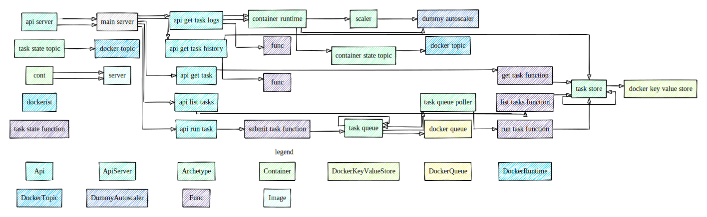

# Anthill

Library and an optional minimal runtime framework, for 
a pluggable and refactorable Everything-As-A-Code  
event-driven solution architecture, design, infrastructure 
and ... well, code.

Before we jump into the nitty gritty, let's define some axioms.

### Solution Architecture
High level description of components of the solution.

### Solution Design
A concrete implementation of the architecture. One solution would
normally have one architecture at any point in time, but multiple 
designs.

## Hello world

Let's take a simple solution as an example. We want to have
a simple API that will return "Hello, world".


> This repository uses typescript, so the code samples will do the same. Technically, the actual execution runtime really doesn't matter.

And the `hello func` will be something like this:
```typescript
() => ({ message: 'hello world' }
```

What's interesting about this architecture so far is that is absolutely agnostic about how exactly is all that implemented: whether the API are gRPC or node js, running koa, returning JSON; whether it's running locally directly, or in a container; in a lambda function in AWS, in an Azure function, or in a virtual machine.

_This is the main point of @Anthill - the architecture of a solution can be decoupled from the implementation. This will allow portability and architecture refactoring._

Let's have a look at a complete architecture of the `hello-world`.

```typescript
/**
 * A function that takes no input and returns a string message
 * */
export const helloFunc = new Func<void, { message: string }>({
    code: () => ({ message: 'hello world' }),
    name: 'hello func'
});

/**
 * An API that knows that it will call a function
 * */
export const helloApi = new Api<void, { message: string }>({
    target: helloFunc,
    name: 'hello api'
});

```

By the way, since the architecture is described in typescript, this diagram: 


was generated by using typescript compiler API using `@anthill/vis` module. 

Here's a little more elaborate architecture 



And here's the same architecture from above with the docker implementation (drawing is still a WIP).


Because we can.

Now, I mentioned docker implementation. Let's get back to the `hello world`.

We have defined the solution architecture


Now, let's define how to run this. Let's start with a 
local execution using docker as a runtime environment.

At this stage we know some more information:
- this will use docker
- run on localhost
- we choose 8080 as port where to listen on
- the api will be HTTP JSON (aka JSON RPC)

```typescript
/**
 * We will run this on localhost:8080
 * */
const mainApi = {
    apiName: 'hello-world',
    init: {
        name: 'main',
        port: 8080,
        host: '127.0.0.10'
    }
};

const mainServer: ApiServerProps = {
    name: mainApi.apiName,
    listener: {
        host: mainApi.init.host,
        port: mainApi.init.port,
        apis: [
            {
                api: arch.helloApi,
                spec: {
                    method: 'GET',
                    path: '/v1/hello'
                }
            }
        ]
    }
};

new ApiServer(mainServer, () => run(mainServer));
```

My tool of choice to deploy infrastructure is [CDKTF](https://www.terraform.io/cdktf). Conveniently, it supports docker as a deployment target.

Let's define the CDK stack.

```typescript
class DorcStack extends TerraformStack {
    constructor(scope: Construct, name: string) {
        super(scope, name);
    };
}

const app = new App();
const stack = new DorcStack(app, "anthill-hello-world");
```

And finally, the docker to run the server in
```typescript

/**
 * Build docker image
 * */
const dockerImage = new Image(stack, 'hello-world-api-server', {
    name: 'hello-world-api-server',
    buildAttribute: {
        path: '/my/project/root/folder',
        dockerfile: 'my-api.Dockerfile'

    }
});

const name = `hello-world-${mainApi.init.name}`;

/**
 * And run a container
 * */
const container = new Container(stack, name, {
    dependsOn: [dockerImage],
    name,
    image: dockerImage.latest,
    attach: false,
    // Easy, but we'll have to run individual API on different ports 
    networkMode: 'host',
    ports: [{
        external: mainApi.init.port,
        internal: mainApi.init.port
    }],
    // The image's has entrypoint configured to ours, 
    // we only need to specify which API to run
    command: [
        mainApi.apiName
    ]
});
```

At this point, all is left is to `cdktf deploy --auto-approve` and when done

```shell
$ curl localhost:8080/v1/hello | jq .

{
  "message": "hello world"
}
```

Feels like magic, but it isn't really. 

## How does this all work?

When we create the server's instance
```typescript
new ApiServer({
    name: 'my-happy-api',
...
}, () => run(mainServer));
```

It registers the execution handler `() => run(mainServer)`, under the name `my-happy-api`.

Then, when we create the docker image,
```typescript
const dockerImage = new Image(stack, 'hello-world-api-server', {
    name: 'hello-world-api-server',
    buildAttribute: {
        path: '/my/project/root/folder',
        dockerfile: 'my-api.Dockerfile'
    }
});
```

it packages current application into an image, setting entrypoint to be `ENTRYPOINT ["node", "/var/app/dist/src/run.js"]`.

The `run.js`, in turn, calls the architecture and implementation building (so that all `ApiServer`s register themselves in the runtime registry), and then picks the one to run, passed via the container's `CMD`:
```typescript
const container = new Container(stack, name, {
    ...
    // The image's has entrypoint configured to ours, 
    // we only need to specify which API to run
    command: [
        mainApi.apiName
    ]
});
```

This executes the `() => run(mainServer)`, which, in turn,
starts a simple Koa.js server that will serve our API.

Now we run
`cdktf destroy --auto-approve`

to stop the server and clean up the resources.

And now let's deploy the same to AWS. But that's a TODO.