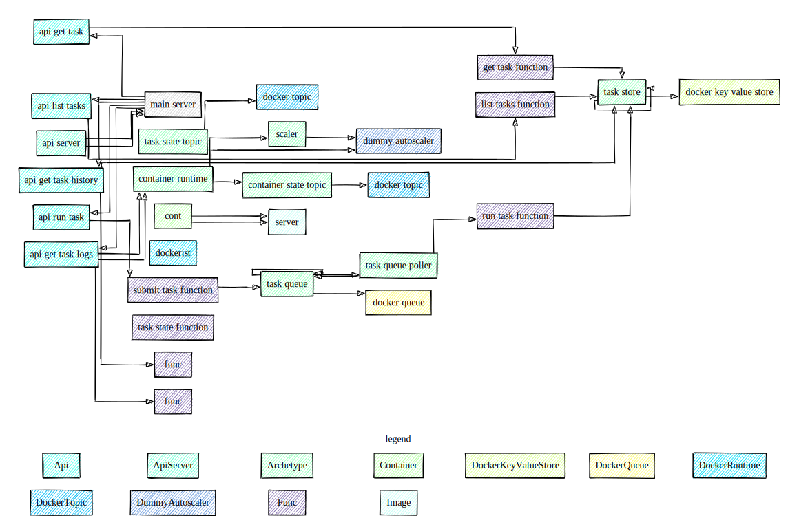

# Anthill

Library and an optional minimal runtime framework, for 
a pluggable and refactorable Everything-As-A-Code  
event-driven solution architecture, design, infrastructure 
and ... well, code.

Before we jump into the nitty gritty, let's define some axioms.

### Solution Architecture
High level description of components of the solution.

### Solution Design
A concrete implementation of the architecture. One solution would
normally have one architecture at any point in time, but multiple 
designs.

## Hello world

Let's take a simple solution as an example. We want to have
a simple API that will return "Hello, world".


> This repository uses typescript, so the code samples will do the same. Technically, the actual execution runtime really doesn't matter.

And the `hello func` will be something like this:
```typescript
() => ({ message: 'hello world' }
```

What's interesting about this architecture so far is that is absolutely agnostic about how exactly is all that implemented: whether the API are gRPC or node js, running koa, returning JSON; whether it's running locally directly, or in a container; in a lambda function in AWS, in an Azure function, or in a virtual machine.

_This is the main point of @Anthill - the architecture of a solution can be decoupled from the implementation. This will allow portability and architecture refactoring._

Let's have a look at a complete architecture of the `hello-world`.

```typescript
/**
 * A function that takes no input and returns a string message
 * */
export const helloFunc = new Func<void, { message: string }>({
    code: () => ({ message: 'hello world' }),
    name: 'hello func'
});

/**
 * An API that knows that it will call a function
 * */
export const helloApi = new Api<void, { message: string }>({
    target: helloFunc,
    name: 'hello api'
});

```

By the way, this diagram,


since the architecture is described in typescript, was generated by using typescript compiler API using `@anthill/vis` module. 

Here's a little more elaborate architecture

