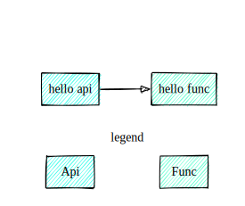
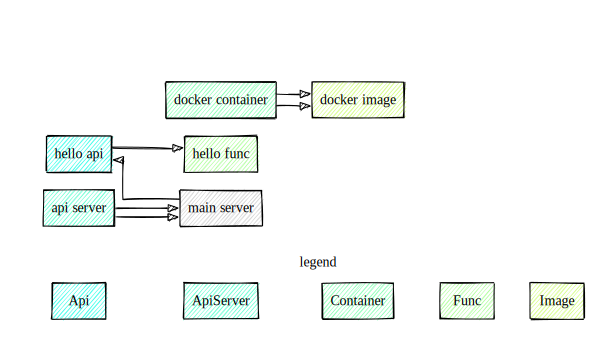
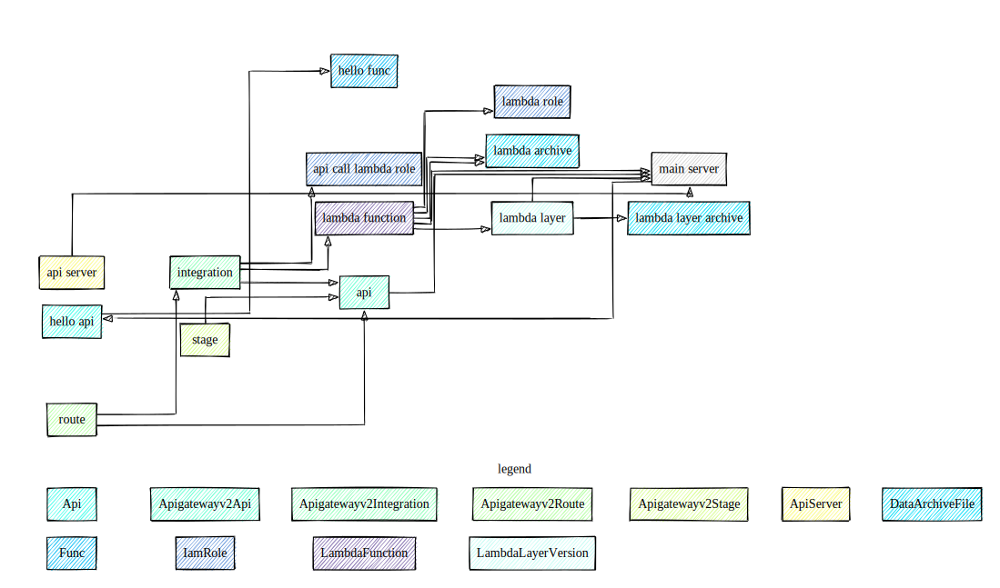

# Arinoto / Anthill

Anthill is a software engineering methodology, allowing for a runtime-agnostic, pluggable, iterative and refactorable Everything-As-A-Code solution architecture, design, infrastructure 
and ... well, code.

There's also a tiny library of primitives and runtime helpers.

> If all you need is a quick start, jump straight to the [Hello world](#hello-world).


Now since you're still here, let's define some axioms.

### Solution Architecture
High level description of components of the solution.

### Solution Design
A concrete implementation of the architecture. At any point in time, a solution would normally have one architecture, but could have multiple 
designs.

## Why

### Separate business logic and implementation

> Theoretically, there's no difference between theory and practice.
Practically, there is.

By separating architecture and design, we allow for a clear-cut segregation between what a solution needs to be doing (its business logic) and how it's doing it.

Common sense so far.

The advantage of this approach, though, is that same business logic can be ran on different targets - it becomes unaware of where it's executed and this permits us to: 

### Avoid or at least postpone costly lock-in decisions

From an architect's point of view it doesn't matter whether an API is served from an AKS, AWS API Gateway or a Raspberry Pi plugged next to my TV.

Furthermore, I believe we've reached sufficient level of code portability and "fetch a record by ID and return it as JSON" doesn't need to know where it's running and what the record storage exactly is. We can abstract that away and decide those details later.

### Carefully embrace imperfection of abstraction 

One of the pitfalls of the agnostic abstraction is an attempt to avoid leaky abstractions.

For any non-trivial use case, this doesn't work.

Surprisingly, most solutions these days chose either a complete abstraction or no-abstraction. The hybrids are rare and awkward (deploying lambda functions using k8s controllers, really?).

#### No-abstraction camp

The no-abstraction camp simply makes an early decision on the target stack and works with that directly. An example would be completely separate iOS and Android applications for the same product, or solutions designed to explicitly run on AWS, Azure or GCP.

This approach has the advantage of maximally utilising the target platform.

The main drawback is that a solution, designed, for instance, with AWS services in mind, is not immediately convertible to Azure. And making the code portable afterwards is not easy.

Effectively, this is the sweet vendor lock-in. Sweet, for the vendor.

#### The full abstraction camp

The examples here are Kubernetes, React Native, Electron, etc.
This is the opposite side of the spectrum, where the abstraction layer attempts to eliminate the platform differences.

The vendor lock-in is solved, but one loses the advantages of vendor-specific services or creates a hodgepodge of abstract code, peppered with conditional compilation to accommodate target platform's specifics. 

#### Anthill

Anthill, on the other hand, takes a middle approach between the two camps. 
> Only parts, relevant to the solution's architecture, are minimally abstracted. 

And it becomes possible thanks to the separation of architecture and design.
In addition, since the abstractions are minimal, it's possible to fine tune them for a specific solution. One doesn't need a universal set of abstractions, that are correct for all cases.

Furthermore, this allows refactoring architecture whenever necessary during the project's lifecycle.

Enough theory. Let's code.

## Hello world

Let's take a simple solution as an example. We want to have
a simple API that will return "Hello, world".



> This repository uses typescript, so the code samples will do the same. Technically, the actual execution runtime really doesn't matter.

And the `hello func` will be something like this:
```typescript
() => ({ message: 'hello world' }
```

What's interesting about this architecture so far is that it is absolutely agnostic about how exactly is all that implemented: whether the API are gRPC or node.js, running koa, returning JSON; whether it's running locally directly, or in a container; in a lambda function in AWS, in an Azure function, or in a virtual machine.

_This is the main point of @Anthill - the architecture of a solution can be decoupled from the implementation. This will allow architecture refactoring and having multpile non-conflicting implmentations of the same architecture._

Let's have a look at a complete architecture of the `hello-world`.

```typescript
/** Data definitions */

/**
 * Input payload for the API
 * */
export type HelloInput = void;

/**
 * What the API returns
 * */
export type HelloOutput = { message: string }; 


/** Architecture  */

/**
 * A function that takes no input and returns a string message
 * */
export const helloFunc = new Func<HelloInput, HelloOutput>({
    code: () => ({ message: 'hello world' })
});

/**
 * An API that knows that it will call a function
 * */
export const helloApi = new Api<HelloInput, HelloOutput>({
    target: helloFunc
});

```

By the way, since the architecture is described in typescript, this diagram: 


was generated by using typescript compiler API using `@anthill/vis` module. 

And here's an example of a slightly more elaborate architecture running locally using docker implementation (drawing is still a WIP).


Because we can.

### Business logic is separate from the infrastructure.

If we were to have our API function to lookup something from, say, a key-value store, the code would look something like this:

```typescript

// this creates a strongly typed class definition for the key-value store
const HelloKeyValueStore = KeyValueStore<string, string>();

// this creates an instance of the key-value store
const helloStore = new HelloKeyValueStore();

export const helloFunc = new Func<HelloInput, HelloOutput>({
    code: async () => {
        
        // `get` is an API of the k-v store
        const value = await helloStore.get.exec('world');

        return { message: `hello ${value}` }
    }
});
```

> Still, no assumptions of what kind of key-value store - we're still free to plug one we need. 

Now, I mentioned docker implementation. Let's get back to the `hello world`.

We have defined the solution architecture


Now, let's define how to run this. Let's start with a 
local execution using docker as a runtime environment.

At this stage we know some more information:
- this will use docker
- run on localhost
- we choose 8080 as port where to listen on
- the API will be HTTP JSON (aka JSON RPC)

```typescript
/**
 * We will run this on localhost:8080
 * */
const mainApi = {
    apiName: 'hello-world',
    init: {
        name: 'main',
        port: 8080,
        host: '127.0.0.10'
    }
};

const mainServer: ApiServerProps = {
    name: mainApi.apiName,
    listener: {
        host: mainApi.init.host,
        port: mainApi.init.port,
        apis: [
            {
                api: arch.helloApi,
                spec: {
                    method: 'GET',
                    path: '/v1/hello'
                }
            }
        ]
    }
};

new ApiServer(mainServer, () => run(mainServer));
```

My tool of choice to deploy infrastructure is [CDKTF](https://www.terraform.io/cdktf). Conveniently, it supports docker as a deployment target.

Let's define the CDK stack.

```typescript
class HelloStack extends TerraformStack {}

const app = new App();
const stack = new HelloStack(app, "anthill-hello-world");
```

And finally, the docker to run the server in
```typescript

/**
 * Build docker image
 * */
const dockerImage = new Image(stack, 'hello-world-api-server', {
    name: 'hello-world-api-server',
    buildAttribute: {
        path: '/my/project/root/folder',
        dockerfile: 'my-api.Dockerfile'

    }
});

const name = `hello-world-${mainApi.init.name}`;

/**
 * And run a container
 * */
const container = new Container(stack, name, {
    dependsOn: [dockerImage],
    name,
    image: dockerImage.latest,
    attach: false,
    // Easy, but we'll have to run individual API on different ports 
    networkMode: 'host',
    ports: [{
        external: mainApi.init.port,
        internal: mainApi.init.port
    }],
    // The image's has entrypoint configured to ours, 
    // we only need to specify which API to run
    command: [
        mainApi.apiName
    ]
});
```

At this point, all is left is to `cdktf deploy --auto-approve` and when done

```shell
$ curl localhost:8080/v1/hello | jq .

{
  "message": "hello world"
}
```

Feels like magic, but it isn't really. 
The full solution's implementation using docker looks like this:



## How does this all work?

When we create the server's instance
```typescript
new ApiServer({
    name: 'my-happy-api',
...
}, () => run(mainServer));
```

It registers the execution handler `() => run(mainServer)`, under the name `my-happy-api`.

Then, when we create the docker image,
```typescript
const dockerImage = new Image(stack, 'hello-world-api-server', {
    name: 'hello-world-api-server',
    buildAttribute: {
        path: '/my/project/root/folder',
        dockerfile: 'my-api.Dockerfile'
    }
});
```

it packages current application into an image, setting entry point to be `ENTRYPOINT ["node", "/var/app/dist/src/run.js"]`.

The `run.js`, in turn, calls the architecture and implementation building (so that all `ApiServer`s register themselves in the runtime registry), and then picks the one to run, passed via the container's `CMD`:
```typescript
const container = new Container(stack, name, {
    ...
    // The image's has entrypoint configured to ours, 
    // we only need to specify which API to run
    command: [
        mainApi.apiName
    ]
});
```

This executes the `() => run(mainServer)`, which, in turn,
starts a simple Koa.js server that will serve our API.

Now we run
`cdktf destroy --auto-approve`

to stop the server and clean up the resources.

And now let's deploy the same to AWS. 
We will use AWS API Gateway and the code will run in a lambda function:



Similar to docker, we define an API server. 
```typescript
export const mainServer: ApiServerProps = {
    name: 'hello-world',
    listener: {
        apis: [
            {
                api: arch.helloApi,
                spec: {
                    method: 'GET',
                    path: '/v1/hello'
                }
            }
        ]
    }
};

export const apiServer = new ApiServer(mainServer);
```

> Note, that since we'll be using an AWS API Gateway, we don't need to specify the host and port to listen on.

The AWS diagram is quite a mouthful, but that's only because we need to specify all the tiny details like IAM Roles to use, lambda function, its layer and their zip archives, the integration between API methods and the lambda function.

You can see the whole set up under [aws-build.ts](/modules/demos/hello-world/hello-world.aws/src/aws-build.ts). 

And just like with docker execution, we have a single entry point under [run-lambda.ts](modules/demos/hello-world/hello-world.aws/src/run-lambda.ts) that collects what it needs to run from `process.env.ANTHILL_RUNTIME`, discovers the appropriate API and, since it's perfectly aware that it's running as an AWS Lambda, takes the payload, prepares it for the API and executes it.

### In the end, by segregating areas of concern, we could 
- describe high-level business logic 
- extend that to apply to different runtime targets
- and, since every aspect is defined in typescript, any changes to the business logic will cascade to the lower levels, so the contracts between different parts will be ensured either at the compile level or at runtime.

The last part is a TODO - we need to generate JSON Schema documents from payload definitions and integrate validation into API execution.

Same for the OpenApi documentation. We don't need to maintain those by hand - we can derive them from our code.

## Q&A
Q. How is anthill different from AWS CDK, Pulumi?
    
    A: You can (and probably should) use any of those to deliver actual infrastructure (the examples here use CDKTF). 

Q. How is it different from dapr.io?

    > Note. I've only superficial knowledge of Dapr.
    A: First, Dapr uses YAML to late-bind code and infrastructure. Yuck.
    Second, Dapr, offers a universal runtime that attempts to abstract away the target platform, thus making it closer to the full-abstraction camp. 
    Third, if you look at the hello world* Dapr, they create an express server first - that's a very strong assumption, compared to the anthill.

    * https://github.com/dapr/quickstarts/tree/master/tutorials/hello-world


## TODO

- Validation that all architecture components have received full implementation.
- Docs on how anthill doesn't use OO but Entity objects to have partially implemented non-abstract classes.